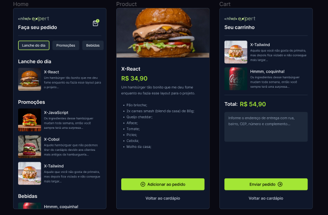

#  APLICATIVO DE PEDIDO DE LANCHES 




# Explicação

O projeto representa um aplicativo de pedido de lanches. Onde o cliente vai poder escolher e enviar os pedidos e o seu endereço para o estabelecimento.

# Páginas

O aplicativo oferece uma intuitiva experiência de navegação, apresentando uma página dedicada à lista de lanches e bebidas. Ao selecionar um lanche específico, o cliente é redirecionado para uma tela detalhada do produto. Nesse espaço, ele pode explorar informações cruciais como preço, descrição e ingredientes do lanche.

Na mesma tela, o cliente tem a facilidade de adicionar o lanche ao carrinho ou retornar à lista de opções disponíveis, simplificando o processo de escolha.

Além disso, o aplicativo conta com uma página exclusiva para o carrinho, proporcionando ao cliente uma visão clara da quantidade de cada item escolhido e o total da sua compra. Nesse estágio, é necessário fornecer o endereço de entrega do pedido, sendo que o cliente pode concluir o processo enviando o pedido diretamente para o WhatsApp do estabelecimento. Isso garante uma transição suave do processo de seleção de produtos para a finalização da compra, oferecendo praticidade e eficiência ao usuário.

# Tecnologias

- React Native
- TailwindCss
- AsyncStorage 
- Expo
- React-native-safe-area-context
- Zustand
- Typescript
- Vector-icons
- React-navigation

# Como usar?
Antes de começar, você precisa ter o Git e o Node instalados.

```bash
# Clone this project
git clone https://github.com/Diegoh-dev/nlw-expert-rn.git
# access
cd nlw-expert-rn
# install dependencies
 npm
# Run the project
$ npm start 
```
    

# Colaboradores

- Diegoh-dev
